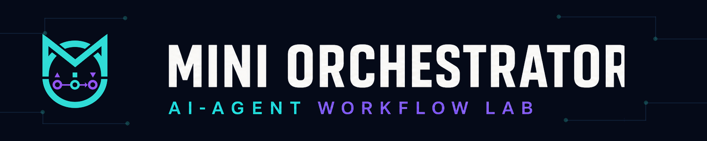

<p align="center">
  
</p>

# Mini Orchestrator

**English** · [Русский](README.ru.md) · [Detailed guide](docs/README.extended.md)

Mini Orchestrator is a local, observable workspace for designing and running
approval-gated AI-agent workflows. A user describes a task, reviews the proposed
plan, explicitly approves it, and then watches the selected agent chain execute
stage by stage.

Example task:

```text
orchestrator plan Build a calculator
```

The Russian equivalent is supported in the UI:

```text
оркестратор план Сделай калькулятор
```

## What it does

- previews a planner proposal before execution;
- runs saved multi-agent chains such as `planner -> executor -> reviewer`;
- lets users build and save custom agent cards and flows;
- supports Dispatcher and Symphony execution adapters;
- shows live stages, logs, timings, worker metadata, and raw results;
- stores project-owned runtime state in SQLite;
- keeps completed work in Human Review until a user accepts it.

The three-agent chain is an example preset, not a fixed architecture. A saved
preset may contain any validated number and order of agents.

## Quick start

Requirements: Python 3.10+ and the project GI config-service records required by
the runtime.

```powershell
python -m venv .venv
. .venv\Scripts\Activate.ps1
python -m pip install -e .
python -m mini_orchestrator --ui
```

Then open the UI, enter a task, request a plan, review it, confirm approval, and
start the workflow.

## Current status

Mini Orchestrator is an experimental orchestration lab, not a finished
production platform. The active product surface is the orchestrator dashboard.
Dispatcher runs are supported directly; Symphony runs use a contract-gated
integration. The visual builder persists flows and presets, while execution
remains approval-gated from the main dashboard.

For architecture, execution modes, storage, integrations, API endpoints,
configuration, and verification commands, read the
[detailed English guide](docs/README.extended.md).
