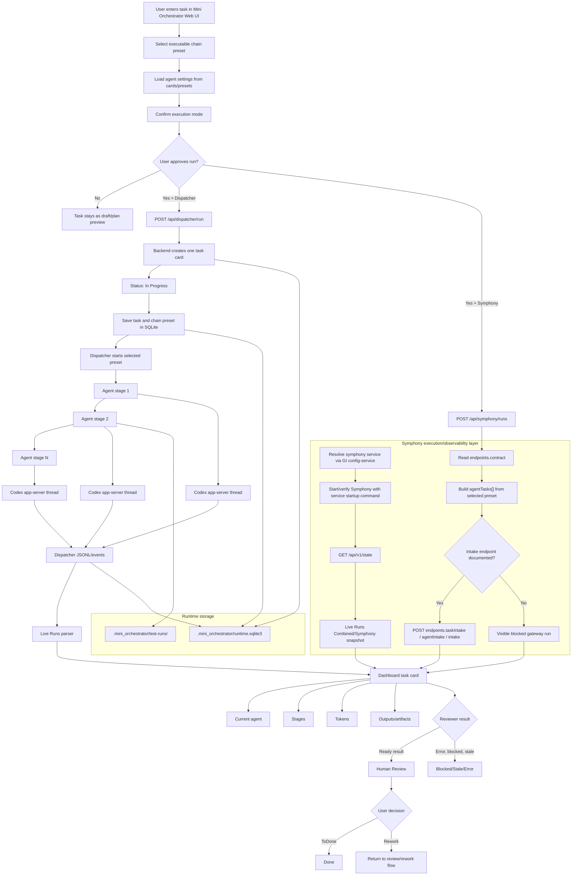

# Task Processing Flow

Date: 2026-06-20

This diagram describes the current Mini Orchestrator task-processing flow.
The user confirms an execution mode before running an approved task. Dispatcher
and Symphony both receive the selected chain preset. The chain is not
hard-coded: `Planner -> Executor -> Reviewer` is only the default example
preset, and saved presets may contain any approved number of configured agents
and stages.

## Current responsibilities

- Dispatcher executes approved tasks through the selected chain preset.
- Symphony mode converts the selected preset into one `agentTasks[]` item per
  configured preset agent and submits it only through a documented intake
  endpoint.
- `Planner -> Executor -> Reviewer` is the default example, not a fixed
  workflow.
- A preset may contain any approved number of configured agents/stages.
- Agent models and behavior come from saved card/chain presets.
- Mini Orchestrator keeps one visible task card while a chain is running.
- SQLite stores runtime state except generated runnable artifacts.
- `test-runs/` stores generated release/demo artifacts.
- Symphony must be running and visible, but currently provides read-only
  daemon observability, not task execution.
