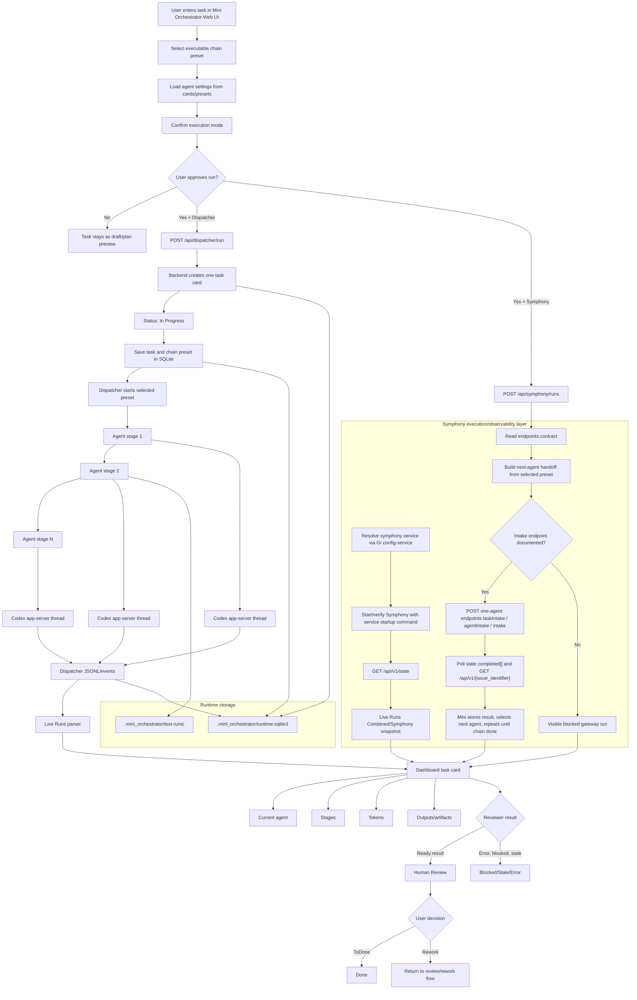

# Task Processing Flow

Date: 2026-06-20

This diagram describes the current Mini Orchestrator task-processing flow.
The user confirms an execution mode before running an approved task. Dispatcher
and Symphony both receive the selected chain preset. The chain is not
hard-coded: `Planner -> Executor -> Reviewer` is only the default example
preset, and saved presets may contain any approved number of configured agents
and stages.



## Current responsibilities

- Mini Orchestrator is the product being built and evaluated. Generated apps
  such as CRM or dental CRM are workload/test artifacts used to exercise the
  orchestrator's planning, execution, validation, Kanban, and Symphony
  observability loop; they must not become the project identity or replace the
  orchestration dashboard goal.
- Dispatcher executes approved tasks through the selected chain preset.
- Symphony mode has a Mini-owned production flow and a compatibility payload
  format. In the production flow, Mini Orchestrator converts the selected preset
  into one next-agent handoff at a time, submits exactly one `agentTasks[]`
  item through a documented Symphony intake endpoint, waits for a retained
  Symphony result, stores that result on the task card, then computes and
  submits the next agent handoff with the previous output as context.
- The older compatibility payload can still represent one `agentTasks[]` item
  per configured preset agent, but it is not the business owner of checklist or
  chain state.
- Symphony completed Mini-origin issues must remain queryable after worker exit.
  The daemon snapshot exposes retained results in `completed[]`, and Mini uses
  `GET /api/v1/{issue_identifier}` as the documented issue-result endpoint.
  Mini normalizes these retained results as `done` Live Runs instead of dropping
  them when `running[]`, `retrying[]`, and `blocked[]` become empty.
- `Planner -> Executor -> Reviewer` is the default example, not a fixed
  workflow.
- A preset may contain any approved number of configured agents/stages.
- Agent models and behavior come from saved card/chain presets.
- Mini Orchestrator keeps one visible task card while a chain is running.
- The web dashboard presents the main task surface as a WorkNest/chat Kanban:
  incoming or approved tasks move through backlog/ready, agent work, human
  review, and done states from normalized run records.
- Symphony worker activity is duplicated into a separate monitor area below the
  Kanban. Each observed `symphony-daemon` worker copy gets a monitor card, and
  the `symphony-daemon-summary` record stays there as health context. These
  monitors are observability only; they do not replace WorkNest as source of
  truth or terminal completion sink.
- SQLite stores runtime state except generated runnable artifacts.
- `test-runs/` stores generated release/demo artifacts.
- Symphony must be running and visible before Symphony-mode tasks start. When
  its contract exposes intake and issue-result endpoints, Mini may submit the
  next-agent handoff payload, poll until the Symphony result is `done`,
  `blocked`, `failed`, or timed out, then either submit the next preset agent or
  stop the task card in the corresponding terminal or review state.

## Current Business Contract

- A task card is the user-visible unit of work. It owns the source text, chosen
  preset, checklist, current checklist item, agent-stage status, artifacts,
  review decision, and final `Done` marker.
- If the selected preset contains a Planner, Planner output may refine the
  checklist. If no decomposition is available, Mini creates one checklist item
  from the original task text.
- Mini Orchestrator owns handoff sequencing. After each Symphony result, Mini
  updates the card/checklist, chooses the next preset agent, and sends a new
  one-agent Symphony request containing the next agent settings plus previous
  outputs.
- Symphony owns worker runtime only: start a fresh worker/agent monitor for
  `symphonyWorkerMode=debug-new-worker`, or reuse a compatible IDLE worker when
  `symphonyWorkerMode=optimal-reuse-idle`, run the supplied agent work package,
  track progress/tokens/retries/blocked state, and return retained result
  details to Mini. The dashboard default is debug-new-worker while the
  integration is being inspected.
- The dashboard should keep two distinct mental models: the main task Kanban
  for Mini/WorkNest cards, and the Symphony monitor area for current or IDLE
  Symphony worker entities.

## Canonical Release Test Task

```text
Полный релизный проект веб приложение с БД контроллерами очередями UI авторизацией и тд проект CRM стоматология.
```
